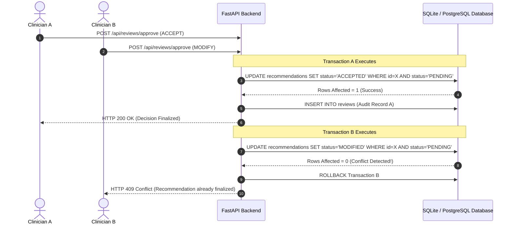

# Concurrency Control & State Transition Protection

## Problem Statement
In high-workload public health operations, multiple clinicians or coordinators may open the outreach planner console concurrently. If two reviewers simultaneously submit decision reviews for the same recommendation, a race condition can cause duplicate audit trail entries, conflicting allocation states, or overwritten decision notes.

---

## Strategy: Atomic State Transitions

To prevent race conditions without complex external lock managers, the application implements **Optimistic Concurrency Control with Atomic Database Updates**.

```sql
UPDATE recommendations
SET status = :new_status,
    expected_reach = :new_reach
WHERE recommendation_id = :rec_id
  AND status = 'PENDING';
```

### Execution Flow:



---

## Conflict Response Contract

When a collision occurs, the server returns an HTTP 409 Conflict response:

```json
{
  "detail": "Concurrent review conflict: recommendation was finalized by another simultaneous user session."
}
```

---

## Key Guarantees

1. **Exactly-Once Finalization**: A pending recommendation can transition to `ACCEPTED`, `MODIFIED`, `REJECTED`, or `OVERRIDDEN` exactly once.
2. **Audit Integrity**: Audit trail records are created only when the atomic state transition succeeds. Failed requests produce 0 audit pollution.
3. **No Database Corruption**: Rolled-back transactions ensure zero orphaned records or half-applied capacity updates.
