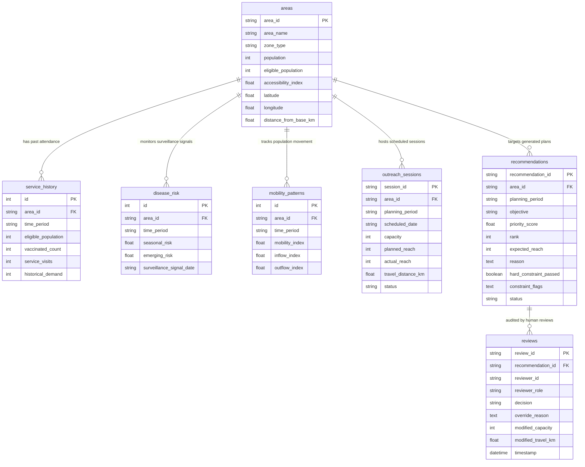

# Relational Database Schema Specification

This document details the relational database schema implemented in SQLite for the **City Health Vaccination Outreach Planner**. All data represents aggregate non-discriminatory city zone indicators.

---

## 📐 Database Entity Relationship (ER) Diagram

---

## 🗄️ Detailed Table Specifications

### 1. `areas` (Primary Geographic Entity)
Represents synthetic city geographic zones and demographic baseline metrics.
- `area_id` (VARCHAR(20), PRIMARY KEY): Zone identifier (e.g. `AREA-01`).
- `area_name` (VARCHAR(100), NOT NULL): Human-readable zone name.
- `zone_type` (VARCHAR(50), NOT NULL): Zone classification (e.g. `High-Density Urban`, `Under-Served Settlement`).
- `population` (INTEGER, NOT NULL): Total resident population in zone.
- `eligible_population` (INTEGER, NOT NULL): Unvaccinated/vulnerable population eligible for seasonal outreach.
- `accessibility_index` (FLOAT, NOT NULL): Road accessibility index from 0.0 (poor vehicle access) to 1.0 (excellent).
- `latitude` (FLOAT, NOT NULL), `longitude` (FLOAT, NOT NULL): Geographic centroid coordinates.
- `distance_from_base_km` (FLOAT, NOT NULL): Driving distance from central health department logistics base.

### 2. `service_history` (Past Session Attendance)
Historical outreach attendance records for baseline benchmarking.
- `id` (INTEGER, PRIMARY KEY AUTOINCREMENT)
- `area_id` (VARCHAR(20), FOREIGN KEY -> `areas.area_id`, NOT NULL)
- `time_period` (VARCHAR(20), NOT NULL): Target season/quarter (e.g. `2026-Q4`).
- `eligible_population` (INTEGER, NOT NULL)
- `vaccinated_count` (INTEGER, NOT NULL): Number of vaccinated residents.
- `service_visits` (INTEGER, NOT NULL): Number of historical mobile visits.
- `historical_demand` (INTEGER, NOT NULL): Average historical session attendance.

### 3. `disease_risk` (Infectious Disease Surveillance Signals)
Surveillance indicators capturing seasonal baselines and emerging outbreak velocity spikes.
- `id` (INTEGER, PRIMARY KEY AUTOINCREMENT)
- `area_id` (VARCHAR(20), FOREIGN KEY -> `areas.area_id`, NOT NULL)
- `time_period` (VARCHAR(20), NOT NULL)
- `seasonal_risk` (FLOAT, NOT NULL): Expected seasonal baseline disease risk (0.0 to 1.0).
- `emerging_risk` (FLOAT, NOT NULL): Outbreak signal spike / transmission velocity (0.0 to 1.0).
- `surveillance_signal_date` (VARCHAR(10), NOT NULL): Date signal was registered.

### 4. `mobility_patterns` (Population Movement & Inflow)
Population movement patterns capturing transit corridors and daytime inflow.
- `id` (INTEGER, PRIMARY KEY AUTOINCREMENT)
- `area_id` (VARCHAR(20), FOREIGN KEY -> `areas.area_id`, NOT NULL)
- `time_period` (VARCHAR(20), NOT NULL)
- `mobility_index` (FLOAT, NOT NULL): Overall population movement index (0.0 to 1.0).
- `inflow_index` (FLOAT, NOT NULL): Daytime transit influx.
- `outflow_index` (FLOAT, NOT NULL): Resident commuter efflux.

### 5. `outreach_sessions` (Completed Outreach Sessions)
Execution logs for completed or scheduled outreach sessions.
- `session_id` (VARCHAR(36), PRIMARY KEY)
- `area_id` (VARCHAR(20), FOREIGN KEY -> `areas.area_id`, NOT NULL)
- `planning_period` (VARCHAR(20), NOT NULL)
- `scheduled_date` (VARCHAR(10), NOT NULL)
- `capacity` (INTEGER, NOT NULL): Doses allocated to session.
- `planned_reach` (INTEGER, NOT NULL)
- `actual_reach` (INTEGER, DEFAULT 0): Actual doses administered.
- `travel_distance_km` (FLOAT, NOT NULL)
- `status` (VARCHAR(30), DEFAULT "PLANNED"): `PLANNED`, `COMPLETED`, `CANCELLED`.

### 6. `recommendations` (Generated Outreach Recommendations)
Generated recommendation entries created by planner engines.
- `recommendation_id` (VARCHAR(36), PRIMARY KEY)
- `area_id` (VARCHAR(20), FOREIGN KEY -> `areas.area_id`, NOT NULL)
- `planning_period` (VARCHAR(20), NOT NULL)
- `objective` (VARCHAR(50), NOT NULL): `MAX_REACH`, `RISK_REDUCTION`, or `HISTORICAL_BASELINE`.
- `priority_score` (FLOAT, NOT NULL): Min-max normalized priority score [0.0, 1.0].
- `rank` (INTEGER, NOT NULL): Priority rank position.
- `expected_reach` (INTEGER, NOT NULL): Achievable reach capped by supply capacity.
- `reason` (TEXT, NOT NULL): Structured JSON factor score breakdown string.
- `hard_constraint_passed` (BOOLEAN, NOT NULL, DEFAULT TRUE)
- `constraint_flags` (TEXT, NULLABLE): Structured JSON warning array string.
- `status` (VARCHAR(30), DEFAULT "PENDING"): `PENDING`, `ACCEPTED`, `MODIFIED`, `REJECTED`, `OVERRIDDEN`.

### 7. `reviews` (Governance Audit Log)
Immutable audit trail logging every human decision and clinical justification override.
- `review_id` (VARCHAR(36), PRIMARY KEY)
- `recommendation_id` (VARCHAR(36), FOREIGN KEY -> `recommendations.recommendation_id`, NOT NULL)
- `reviewer_id` (VARCHAR(50), NOT NULL): Reviewer identifier (e.g. `Clinician.Dr-Vance`).
- `reviewer_role` (VARCHAR(50), NOT NULL): Professional role.
- `decision` (VARCHAR(30), NOT NULL): `ACCEPTED`, `MODIFIED`, `REJECTED`, or `OVERRIDDEN`.
- `override_reason` (TEXT, NULLABLE): Mandatory justification string required when decision is `OVERRIDDEN`.
- `modified_capacity` (INTEGER, NULLABLE): Adjusted dose capacity if modified.
- `modified_travel_km` (FLOAT, NULLABLE): Adjusted travel distance if modified.
- `timestamp` (DATETIME, DEFAULT UTC NOW): Timestamp of human review submission.
