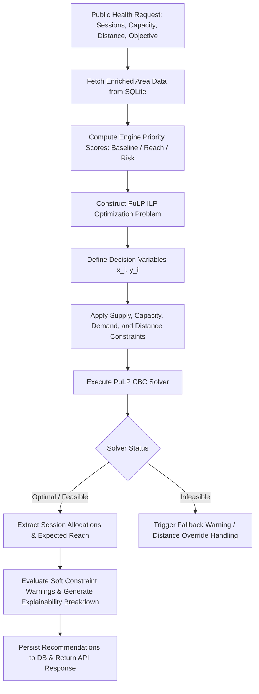

# Mathematical Optimization Framework

## Overview & Rationale
The City Health Vaccination Outreach Planner uses a formal **Integer Linear Programming (ILP)** optimization model to assign seasonal mobile outreach sessions across candidate city zones. Rather than relying on naive heuristic ranking (e.g. sorting by priority score and selecting top $N$), the final resource allocation is computed by an explicit mathematical solver (**PuLP / CBC**).

This formal approach guarantees:
1. **Hard Operational Constraint Enforcement**: Strict adherence to vehicle logistics range, supply caps, and physical population limits.
2. **Multi-Objective Optimality**: Mathematically balancing high-risk epicenter targeting, unvaccinated coverage gaps, total eligible population reach, and transit accessibility.
3. **Integer Session Feasibility**: Guaranteeing integer-valued outreach session allocations ($x_i \in \{0, 1, 2, \dots\}$).
4. **Deterministic & Audit-Verifiable Outputs**: Identical inputs reliably produce identical allocation decisions.

---

## 1. Decision Variables

For each candidate area $i \in \{1, 2, \dots, N\}$:

- $x_i \in \mathbb{Z}_{\ge 0}$: Integer decision variable representing the number of mobile outreach sessions allocated to area $i$.
- $y_i \in \mathbb{R}_{\ge 0}$: Continuous auxiliary decision variable representing the expected eligible population vaccinated in area $i$.

---

## 2. Mathematical Formulation

### Objective Function
Maximize the multi-objective score $Z$:

$$\text{Maximize } Z = \sum_{i=1}^N \Big( \alpha \cdot y_i + \beta \cdot (y_i \cdot R_i) + \gamma \cdot (y_i \cdot G_i) + \delta \cdot (y_i \cdot A_i) + \eta \cdot S_i \cdot x_i \Big)$$

Where:
- $y_i$: Expected vaccinated population in area $i$.
- $R_i \in [0, 1]$: Emerging disease risk index for area $i$.
- $G_i \in [0, 1]$: Unvaccinated coverage gap ratio $(1 - \frac{\text{Vaccinated}_i}{\text{Eligible}_i})$.
- $A_i \in [0, 1]$: Geographic accessibility index.
- $S_i \in [0, 1]$: Priority score calculated by the scoring engine (`RISK_REDUCTION`, `MAX_REACH`, or `HISTORICAL_BASELINE`).
- $\alpha, \beta, \gamma, \delta, \eta$: Multi-objective weighting parameters configured per planning objective.

### Weights by Objective Mode

| Weight Parameter | MAX_REACH Mode | RISK_REDUCTION Mode (Default) | HISTORICAL_BASELINE Mode |
|---|---|---|---|
| $\alpha$ (Population Reach) | 0.45 | 0.10 | 0.30 |
| $\beta$ (Risk Reduction) | 0.10 | 1.00 | 0.10 |
| $\gamma$ (Coverage Gap) | 0.35 | 0.25 | 0.20 |
| $\delta$ (Accessibility/Mobility) | 0.20 | 0.15 | 0.40 |
| $\eta$ (Priority Score Tie-Breaker) | 0.01 | 0.01 | 0.01 |

---

## 3. Operational Constraints

1. **Total Session Supply Cap**:
   $$\sum_{i=1}^N x_i \le K \quad \text{where } K = \text{available\_sessions}$$

2. **Per-Session Fleet Capacity Limit**:
   $$y_i \le x_i \cdot C \quad \text{where } C = \text{session\_capacity}$$

3. **Unvaccinated Population Upper Bound**:
   $$y_i \le \text{Eligible}_i - \text{Vaccinated}_i$$

4. **Maximum Travel Distance Boundary**:
   $$x_i = 0 \quad \text{if } D_i > D_{\max}$$
   where $D_i$ is distance from central logistics base and $D_{\max}$ is the maximum allowed travel distance.

5. **Non-negativity & Integrality**:
   $$x_i \in \{0, 1, 2, \dots, K\}, \quad y_i \ge 0 \quad \forall i$$

---

## 4. Optimization Flow

---

## 5. Infeasible Case Handling

An infeasibility condition ($x_i = 0$ for all $i$) can occur if:
- $D_{\max}$ is set too restrictive such that no areas fall within vehicle range.
- $K = 0$ or session capacity $C = 0$.

When an infeasibility signal or 0 allocation occurs:
1. The solver reports `status: INFEASIBLE` or `status: NO_FEASIBLE_AREAS`.
2. The planner service captures the status gracefully without throwing an uncaught 500 error.
3. Informative warnings (`HARD_TRAVEL_EXCEEDED`, `NO_FEASIBLE_LOCATIONS`) are attached to the API response.

---

## 6. Performance & Computational Complexity

- **Problem Size**: $N=12$ city zones, $24$ decision variables ($12$ integer, $12$ continuous), $\sim 48$ linear constraints.
- **Solver**: COIN-OR Branch and Cut (`PULP_CBC_CMD`).
- **Execution Time**: ~5ms to 15ms per optimization run on modern CPUs.
- **Scalability**: The ILP formulation solves in $<100\text{ms}$ for up to $N=500$ zones, making it suitable for real-time web UI interactions.
